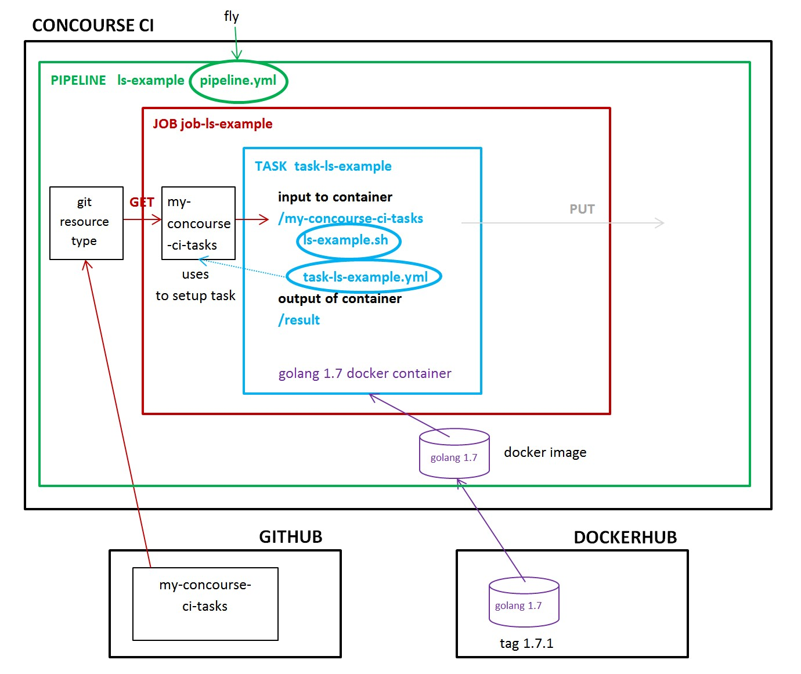

# LS-EXAMPLE

Concourse's main goal is to run tasks.

`ls-example` _lists the files in a repo - a very simple bare bones example of
using concourse._

[GitHub Webpage](https://jeffdecola.github.io/my-concourse-ci-tasks/)

## THE PIPELINE

This `pipeline.yml` shall contain:

* JOBS - job-ls-example
        * RESOURCE - git my-cheat-sheet
        * TASK - `ls-examples.sh` and `task-ls-example.yml`



### 1. ci/`pipeline.yml`

```bash
???
```

### 2. ci/tasks/`task-ls-example.yml`

```bash
???
```

### 1. ci/scripts/`ls-example.sh`

```bash
???
```

NOTE: If in Windows, must change permissions to execute.

Open git for windows,

```bash
git update-index --chmod=+x search-and-replace.sh
```
