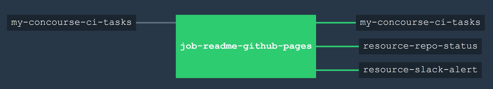

# README-GITHUB-PAGES

Concourse's main goal is to run tasks. So lets do that.

`readme-github-pages` _takes your main README.md, edits and copies it to docs/_includes/README.md.._

[GitHub Webpage](https://jeffdecola.github.io/my-concourse-ci-tasks/)

[My notes on how to install Concourse CI](https://github.com/JeffDeCola/my-cheat-sheets/tree/master/concourse-ci-cheat-sheet)

## FUNCTIONALITY

This task updates your GitHub webpage with the README.md from you main page.

## GITHUB WEBPAGE UPDATED USING CONCOURSE

A Concourse CI Pipeline will automatically update the GitHub WebPage.



A _ci/.credentials.yml_ file needs to be created for your _slack_url_ and _repo_github_token_.

Use fly to upload the the pipeline file _ci/pipline.yml_ to Concourse:

```bash
fly -t ci set-pipeline -p my-concourse-ci-tasks -c ci/pipeline.yml --load-vars-from ci/.credentials.yml
```

## CONCOURSE RESOURCES IN PIPELINE

`my-concourse-ci-tasks` also contains a few extra concourse resources:

* A resource (_resource-slack-alert_) uses a [docker image](https://hub.docker.com/r/cfcommunity/slack-notification-resource)
  that will notify slack on your progress.
* A resource (_resource-repo-status_) use a [docker image](https://hub.docker.com/r/dpb587/github-status-resource)
  that will update your git status for that particular commit.

The above resources can be removed from the pipeline.