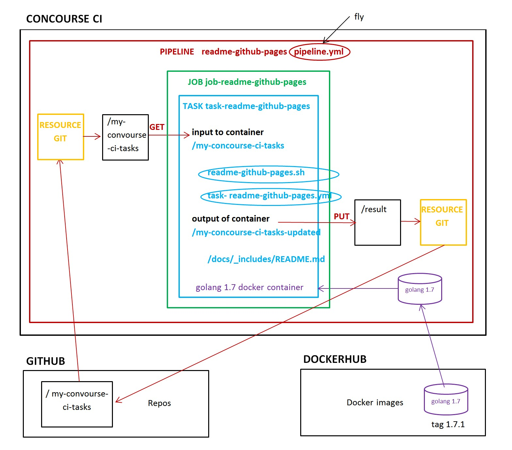
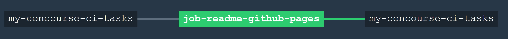

# README-GITHUB-PAGES

Concourse's main goal is to run tasks. So lets do that.

`readme-github-pages` _takes your main README.md, edits and copies it to docs/_includes/README.md.._

[GitHub Webpage](https://jeffdecola.github.io/my-concourse-ci-tasks/)

[My notes on how to install Concourse CI](https://github.com/JeffDeCola/my-cheat-sheets/tree/master/concourse-ci-cheat-sheet)

## FUNCTIONALITY

This task updates your GitHub webpage with the README.md from your main page.

This task is updating this repos [GitHub Webpage](https://jeffdecola.github.io/my-concourse-ci-tasks/).

## THE PIPELINE FILES

The `pipeline.yml` file contains:

* RESOURCE (git) - This gets your repo.
* JOB (job-ls-example) - This runs the task.

The JOB contains the task configuration (`task-readme-github-pages.yml`) and
the bash script (`readme-github-pages.sh`) to perform the task.

This picture may help better illustrate how everything fits together.



## TO CONFIGURE AND USE

1. Clone this Repo or create your own Repo and copy the files.

1. Update the `pipeline.yml` file to point to the proper directory in your
   Repo and where you store your `task-readme-github-pages.yml` file.

1. Create a `.credentials.yml` file to keep you github token and
   remember to update your `.gitignore` file.

1. Upload the `pipeline.yml` to your Concourse CI server.

   ```bash
   fly -t ci set-pipeline -p readme-github-pages -c ci/pipeline.yml \
   --load-vars-from ci/.credentials.yml
   ```

1. Start the pipeline on your Concourse CI by pressing play.

## THE PIPELINE

Concourse CI shall look like,



Now every time you commit to your Repo Concourse CI will run this task.
